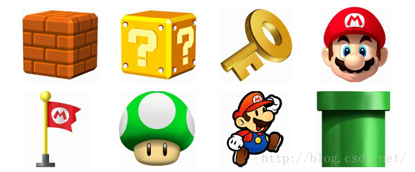

##使用sprite制作动画
动画制作的原理，就是连续播放一系列静止的图片，即可获得一段动画，每张图片可以称做动画的一帧，
就像gif。在easeljs里，提供了一个Sprites类，可以用来创建动画。
创建sprite同创建其他easeljs对象实例一样，只需要调用：
```
new createjs.Sprite(SpriteSheet);

```
很显然，需要使用Spritesheet创建sprite，spritesheet就是一张把每一帧合成起来的一张大图片。
这里要注意，每一帧的尺寸数据要一样，而且这个大图片要是背景透明的。我们来看一下在代码中如何调用：

```
var data = {
//动画所需要的图像路径
//可以是多个图片路径组成的列表
"images":[image.png],
//定义每一帧的数据，宽高等等，形成动画的每一帧
//有两种方法，如果所有的帧的尺寸相同，只需要统一定义
"frames":{width:, height:, count:, regX: , regY:}
//如果帧数据的尺寸不同，分别定义即可
frames: [
            // x, y, width, height, imageIndex, regX, regY,这里的imageIndex对应“images”列表中的图片索引
            [0,0,64,64,0,32,64],//frames0
        ],

//创建动画，动画的名字，以及对应"frames"列表中的哪些帧，也有两种方法
"animations":{
a1:[frame0,framen]}//a1动画从第一帧运行到第n帧
}
//也可以单独列出一个动画所需要的帧数
，同时定义动画完成后的动作，速度等等
animations: {
         a2: {
             frames: [1,,3,5,7],
             next: "a1",//a2播放完成后进入a1
             speed: 2//速度
            }
        }

```
以官方奔跑的小人为例，代码是这样的：
```
var data = {

                "images":["./spritesheet_grant.png"],//图片路径
                "frames":{"height": 292, "width": 165, "count": 64,"regX": 82,  "regY": 0},//每帧的尺寸，count是总帧数
                "animations":{
                    "run": [0, 25, "run", 1.5],//[开始帧，结束帧，动画完成后的动作，速度]
                    "jump": [26, 63, "run"]
                }
}
```
对参数必须包含的三项，images,frames, animations采用合适的方式赋值，参数构造完成后调用.
我们这样调用它：
```
var spriteSheet = new createjs.SpriteSheet(data);
```
现在我们有了一个spritesheet实例了，随后就可以来创建一个sprite动画了。这里有两种办法：

```
//方法一
sprite = new createjs.Sprite(spriteSheet);
sprite.gotoAndPlay("run");
//方法二
sprite = new createjs.Sprite(spriteSheet，"run");

```
最后，我们把sprite添加到stage即可。

```
stage.addChild(sprite);
```

现在你的页面上就有了一个不断走动的小人。
