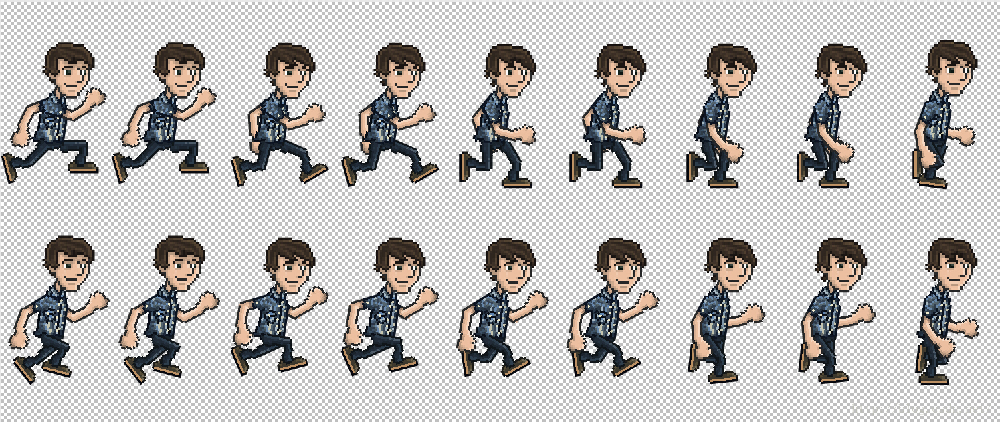
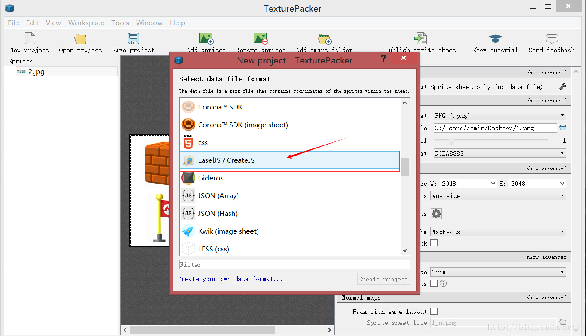

##使用sprite制作动画
动画制作的原理，就是连续播放一系列静止的图片，即可获得一段动画，每张图片可以称做动画的一帧，
就像gif。在easeljs里，提供了一个Sprites类，可以用来创建动画。
创建sprite同创建其他easeljs对象实例一样，只需要调用：
```
new createjs.Sprite(SpriteSheet);

```
很显然，需要使用Spritesheet创建sprite，spritesheet就是一张把每一帧合成起来的一张大图片。
这里要注意，每一帧的尺寸数据要一样，而且这个大图片要是背景透明的。我们来看一下在代码中如何调用：

```
var data = {
//动画所需要的图像路径
//可以是多个图片路径组成的列表
"images":[image.png],
//定义每一帧的数据，宽高等等，形成动画的每一帧
//有两种方法，如果所有的帧的尺寸相同，只需要统一定义
"frames":{width:, height:, count:, regX: , regY:}
//如果帧数据的尺寸不同，分别定义即可
frames: [
            // x, y, width, height, imageIndex, regX, regY,这里的imageIndex对应“images”列表中的图片索引
            [0,0,64,64,0,32,64],//frames0
        ],

//创建动画，动画的名字，以及对应"frames"列表中的哪些帧，也有两种方法
"animations":{
a1:[frame0,framen]}//a1动画从第一帧运行到第n帧
}
//也可以单独列出一个动画所需要的帧数
，同时定义动画完成后的动作，速度等等
animations: {
         a2: {
             frames: [1,,3,5,7],
             next: "a1",//a2播放完成后进入a1
             speed: 2//速度
            }
        }

```


以官方奔跑的小人为例，代码是这样的：
```
var data = {

                "images":["./spritesheet_grant.png"],//图片路径
                "frames":{"height": 292, "width": 165, "count": 64,"regX": 82,  "regY": 0},//每帧的尺寸，count是总帧数
                "animations":{
                    "run": [0, 25, "run", 1.5],//[开始帧，结束帧，动画完成后的动作，速度]
                    "jump": [26, 63, "run"]
                }
}
```
对参数必须包含的三项，images,frames, animations采用合适的方式赋值，参数构造完成后调用.
我们这样调用它：
```
var spriteSheet = new createjs.SpriteSheet(data);
```
现在我们有了一个spritesheet实例了，随后就可以来创建一个sprite动画了。这里有两种办法：

```
//方法一
sprite = new createjs.Sprite(spriteSheet);
sprite.gotoAndPlay("run");
//方法二
sprite = new createjs.Sprite(spriteSheet，"run");

```
最后，我们把sprite添加到stage即可。

```
stage.addChild(sprite);
```

现在你的页面上就有了一个不断走动的小人。


>可不可以构造一个只有一帧的动画？

只有一帧的动画，其实就是一个静止的图片。
很多时候，尤其是编写前端CSS是，很多人喜欢把用到的所有图片合成为一个大图，
在使用Createjs制作游戏时也是一样，把用的图片合成为一个大图，
然后使用sprite把其中的每个图片分解出来，当然你也可以用Bitmap中的Rectangle来选取部分图片。
比如有一个素材的图片包含你的游戏用到的所有图：


使用Sprite把图片逐个分离出来，代码看起来是这样的：
```
var data2 = {
                "images":["./mario.png"],
                "frames":[
                    [2, 2, 32, 32],
                    [34, 2, 32, 32],
                    [66, 2, 32, 32],
                    [100, 2, 32, 32],
                    [2, 34, 32, 32],
                    [34, 34, 32, 32],
                    [66, 34, 32, 32],
                    [100, 34, 32, 32],

                ],
                "animations":{
                    "wall":[0],
                    "gold":[1],
                    "key":[2],
                    "head":[3],
                    "flag":[4],
                    "mush":[5],
                    "mario":[6],
                    "tube":[7]
                }
            };
            var marioSheet = new createjs.SpriteSheet(data2);
```
好了，所有的图片都被分解为8个帧，而在“animations”中又分别创建了8个单帧的动画，
然后你获得了一个marioSheet，当你有了这个marioSheet之后，
游戏制作中需要那个图片时，只需要调用:

```
var  wall  = new createjs.Sprite(marioSheet,"wall");
var gold = new createjs.Sprite(marioSheet,"gold");

```
>如何把所有图片合成到一个大图？

可以用photoshop，还有一个软件，叫做TexturePacker，网址：https://www.codeandweb.com/texturepacker


下载安装后可以试用，选择EasalJS/CreateJS格式。它不但可以合成图片，而且可以生成一个json格式的数据，此处有惊喜。
把你制作游戏中用到的图片都拖进来，或者直接选择图片目录即可，点击publish sprite sheet，
在你选定的目录中就会出现你想要的合成图片和一个json文件，
打开json后你会惊讶的发现，它看起来非常眼熟，
是不是很像你在构建SpriteSheet时使用的参数data，
把需要的部分复制出来，让构建SpriteSheet变非常简单。（其实可以使用preloadJS直接载入这个json文件）

>如何获取一个连续动作的图片？

CreateJS官方提供的工具中，使用zoe工具可以把flash文件转变为sprite（这就是亲儿子的力量）。
最妙的是，同TexturePacker一样，使用zoe转化后，你将获得一个所有连续动作组成的大图，和一个json数据。

>当一个动画播放完毕，如何删除这个动画?
假设你有个飞机爆照效果的动画Sprite，飞机被击中后爆炸，当然只会爆照一次，动画播放完成后，必须在舞台Stage中删除这个动画，
怎么才能让舞台在动画播放完成时收到通知并删除它呢？
在官方的API中，每个类的都有自己可以对应的事件event，打开Sprite页面，在event中可以看到animationend事件，
就是动画播放结束所触发的，当你想在动画播放结束时删除掉这个动画，只需要：

```
sprite.addEventListener('animationend',function(event){
                    stage.removeChild(event.target);
                });
```
所有的时间相应函数都有一个event参数，其中的event.target指向触发事件的元素。这样在动画结束后，就被从舞台上删除了。